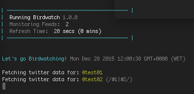

# Birdwatch :baby_chick::watch:

> Get raw tweets from one or more specific twitter feeds. 
> *Optionally filter the tweets by hashtag!*

[](https://travis-ci.org/radiovisual/birdwatch)

Birdwatch will help you grab tweets from specific twitter accounts, and cache the tweets on your server, 
thus avoiding any request limits set by the Twitter API, and giving you more control over the data that is saved.
**You can filter tweets by hashtags, or ignore retweets!** 

**Note:** This is a work in progress. *Pull requests welcome!*

## Installation

**Step 1:** Install the package via npm
```
$ npm install --save birdwatch
```

**Step 2:** Add your twitter app credentials to the configuration file
  1. Copy the file: `node_modules/birdwatch/configure/birdwatch-config.js`
  2. Paste the copied file from step #1 into your app's **root directory**
  3. Now update the `birdwatch-config.js` file with your Twitter app credentials and save the file.
  4. *Now you're ready to birdwatch!*

*Note: Skipping these steps will tell the app to serve up fake tweet data for testing purposes.

## Usage

```js

var Birdwatch = require('birdwatch');

var birdwatch = new Birdwatch({refreshTime: 500})
    .feed('gulpjs')
    .feed('reactjs', {filterTags: /#reactjs/i })
    .feed('nodejs',  {filterTags: /#nodejs/i, removeRetweets:true  });

birdwatch.start(function (err) {
    if(err) { console.log(err); }
});

// Now get your tweets in JSON format to serve or print
birdwatch.getCachedTweets().then(function(tweetdata){
    console.log(tweetdata);
});

```

## Features

### Cached HTML Tweet
 - If birdwatch can't find an `html` string on the returned tweet data, then it adds one for you using [tweet-patch](https://github.com/radiovisual/tweet-patch). 
   This means the plain-text hashtags, user-mentions and hyperlinks are converted to twitter-ready HTML. Example below.
   
 - ```js
   cached_tweets[0].text;
   //=> "This is the #plaintext tweet"
   
   cached_tweets[0].html;
   //=> "This is the <a href="https://twitter.com/hashtag/plaintext">#plaintext</a> tweet"
   ```
   
## API

### Birdwatch([options])

#### options

Type: `object`

Options set here will override the defaults in the constructor.

##### refreshTime

Type: `number` *(seconds)*<br>
Default: `600`

The number of seconds to wait before the cache updates again. The default is 10 minutes (600 seconds)
 
**Tip:** Update your cache frequently, but not frequently enough to hit any [Twitter API Rate Limits](https://dev.twitter.com/rest/public/rate-limits).
  
##### logReports

Type: `boolean`<br>
Default: `false`

Shows a pretty-printed update to the console. Useful for debugging and logging.

# 

##### useTestData

Type: `boolean`<br>
Default: `false`

Use the test tweet data instead of making a network requests. Useful for testing/debugging.

##### cacheFile

Type: `path`<br>
Default: `${__dirname}/cache/cached_tweets.json`

The location of the cache file. Use this option if you want the cache file to be saved in a new location.

##### sortBy

Type: `function`<br>

Override the custom sorting function. Birdwatch defaults sorting to chronological order.

### birdwatch.feed(screenname, options)

Add a twitter feed.

#### screenname

*Required*<br>
Type: `string`

The screenname of the twitter account you want to watch.

#### options

Type: `object`

Feed options.

##### Possible Options:

`filterTags`<br>
  The regular expression containing the tags you want to filter with.<br>
  Type: `Regex`<br>
  Default: `none`
  
  **Tip:** If you need help writing your regular expressions, try [regexpal.com](http://regexpal.com/)
   
`removeRetweets`<br>
  Use this if you want to remove retweets from the feed you are watching.<br>
  Type: `boolean`<br>
  Default: `false`


### birdwatch.start()

Start the Birdwatch process. `.start()` returns a Promise if you want to log when Birdwatch is ready.

### birdwatch.getCachedTweets()

Use this to access the birdwatch cache of tweets in the JSON format

Returns: `Array`

### License

MIT @ [Michael Wuergler](http://numetriclabs.com/)

