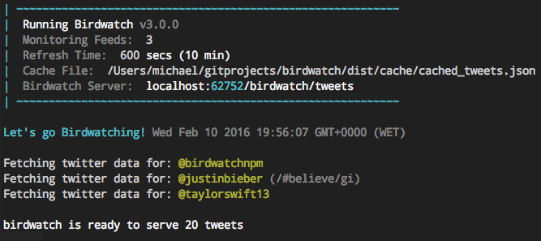

# Birdwatch :baby_chick::watch:

> Get and cache raw tweets from one or more specific twitter feeds. 
> *Optionally filter the tweets by hashtag!*

[](https://travis-ci.org/radiovisual/birdwatch)

Birdwatch will help you grab tweets from specific twitter accounts, and cache the tweets on your server, 
thus avoiding any request limits set by the Twitter API, and giving you more control over the data that is saved.
**You can filter tweets by hashtags, or ignore retweets!** 

**Note:** This is a work in progress. If you find any bugs, or have suggestions [please report them](https://github.com/radiovisual/birdwatch/issues). If you want to help, pull requests are always appreciated! 

## Installation

**Step 1:** Install the package via npm
```
$ npm install --save birdwatch
```

**Step 2:** Add your twitter app credentials to the configuration file
  1. Open the file `node_modules/birdwatch/birdwatch-config.js`
  2. Update the file with your Twitter App credentials.
  3. Rename the file to `local-config.js`
  4. *Now you're ready to birdwatch!* :baby_chick: :bowtie: 

## Usage

```js
var Birdwatch = require('birdwatch');

const bw = new Birdwatch()
	.feed('justinbieber')
	.feed('taylorswift13', {filterTags:['tagOne', 'tagTwo']})
	.start()
	.then(tweets => {
	    console.log('birdwatch is ready to serve %s tweets', tweets.length);
	});
```

By default, Birdwatch will launch a server on port `8417` for you, but you can change the port number using the `port` option. After running the code above, you can access your tweets at the default location:

```
http://localhost:8417/birdwatch/tweets
```

### Cached HTML Tweet
If birdwatch can't find an `html` string on the returned tweet data, (which is sometimes the default from the Twitter API), then one will be rebuilt and added for you via [tweet-patch](https://github.com/radiovisual/tweet-patch). This means the **plaintext** hashtags, user-mentions and hyperlinks are converted to twitter-ready HTML. ::heart_eyes:: (You're welcome) Example below.
   
```js
cached_tweets[0].text;
//=> "This is the #plaintext tweet"
   
cached_tweets[0].html;
//=> "This is the <a href="https://twitter.com/hashtag/plaintext">#plaintext</a> tweet"
```

### Built-in Server

Birdwatch v3 comes equipped with it's own built-in server. You don't have to configure the server at all, it will launch just fine using the defaults, but in case you need more control, you can configure the server by:

- [Turning it on or off](https://github.com/radiovisual/birdwatch#server) using the `server: <true|false>` option. 
- [Override the url to the Birdwatch cache](https://github.com/radiovisual/birdwatch#cacheDir) with the `cacheDir: <path>` option
- [Specify the port](https://github.com/radiovisual/birdwatch#port) you want the server to run on with the `port: <portnumber>` option
- [Optionally serve test data](https://github.com/radiovisual/birdwatch#testData) in a JSON format using the `testData: <json>` option

**Tip:** If you have your own caching server, just turn the Birdwatch server off, and feed your server the Birdwatch cache file.
 
## API

### Birdwatch([options])

#### options

Type: `object`  

Options set here will override the defaults in the constructor.

##### logReports

Type: `boolean`  
Default: `true`

Pretty-print birdwatch activity to the console.

# 

##### refreshTime

Type: `Number`  
Default: `600`  

The number of seconds to wait before the cache updates again. The default is 10 minutes (600 seconds)
 
**Tip:** Update your cache frequently, but not frequently enough to hit any [Twitter API Rate Limits](https://dev.twitter.com/rest/public/rate-limits).

##### server

Type: `boolean`  
Default: `true`  

Boolean to turn the server off or on. Turn the server off if you want to run your own server. Your own server can do whatever it wants with the cache file in `birdwatch/dist/cache/`

##### port

Type: `number`  
Default: `8417`  

Assign a port to the Birdwatch server. If you set a port of `0` the server will assign an open port for you, and you can get the port number with the `logReport: true` setting or using `birdwatch.options.port`

##### url

Type: `string`  
Default: `/birdwatch/tweets`

The url you want to use to access the cached tweets. Requires the server to be running.

##### cacheDir

Type: `string`  
Default: `${__dirname}/cache/`  

Override the location of the cache file. Make sure you have appropriate read/write permissions on this directory.

##### testData

Type: `json`  

Serve tweet data in JSON format to birdwatch. Useful for testing/debugging without making network requests.

##### sortBy

Type: `function`  
Default: `tweet => { return new Date(tweet.created_at) * -1; }`    

Override the custom sorting function. Birdwatch defaults sorting to chronological order.

### birdwatch.feed(screenname, [options])

Add a twitter feed.

#### screenname

*Required*  
Type: `string`  

The screenname of the twitter account you want to watch.

#### options

Type: `object`  

Feed options.

##### filterTags
  
Type: `Regex|Array`  
  
The regular expression containing the tags you want to filter with, or an array of strings. For example, all of these examples will result in the same filter:

```js
.feed('user1', {filterTags: /#01|#02/gi })
.feed('user2', {filterTags: ['01','02'] })
.feed('user3', {filterTags: ['#01','#02'] })
```
**Tip:** If you need help writing your regular expressions, try [regexpal.com](http://regexpal.com/)

##### limit
  
Type: `number`  
Default: `12`  
  
Set a limit on how many tweets you want to cache from the feed. If you are watching three feeds with a limit of 10, you will have a cache of 30 tweets.
   
##### removeRetweets
  
Type: `boolean`  
Default: `false`  

Use this if you want to remove retweets from the feed you are watching.

### birdwatch.start()

Start the Birdwatch process.

### License

MIT @ [Michael Wuergler](http://numetriclabs.com/)

