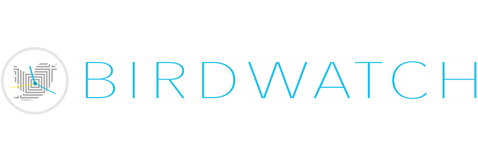
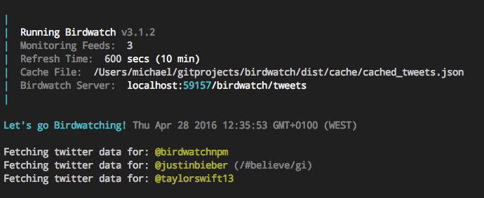

[](https://travis-ci.org/radiovisual/birdwatch)
[](https://coveralls.io/github/radiovisual/birdwatch?branch=master)

Birdwatch helps you fetch, filter, sort, cache and serve specific tweets from specific twitter accounts, thus avoiding any request
limits set by the Twitter API, and giving you more control over the data that is served to your applications or websites.
 Use the built-in server to get you up and running quickly, or switch the server off and use the cache file anyway you like.

If you find any bugs, or have suggestions [please report them](https://github.com/radiovisual/birdwatch/issues). If you want to help, pull requests are always appreciated! 


## Installation

**Step 1:** Install the package via npm
```
$ npm install --save birdwatch
```

**Step 2:** Add your Twitter App Credentials via environment variables

There are a number of ways to set environment variables in your app, some depend on your operating system. I use [dotenv](https://github.com/motdotla/dotenv), but you can use
the command line, a makefile or npm. No matter what method you choose, your environment variables should have the following names:

- `CONSUMER_KEY` : Your Twitter Consumer Key
- `CONSUMER_SECRET` : Your Twitter Consumer Secret
- `ACCESS_TOKEN` : Your Twitter Access Token
- `ACCESS_TOKEN_SECRET` : Your Twitter Access Token Secret

*Now you're ready to birdwatch!* :bowtie: 


## Usage

```js
var Birdwatch = require('birdwatch');

new Birdwatch()
    .feed('justinbieber')
    .feed('taylorswift13', {filterTags:['tagOne', 'tagTwo']})
    .start()
    .then(tweets => {
        console.log('birdwatch is ready to serve %s tweets', tweets.length);
    });
```

By default, Birdwatch will launch a server on port `8417` for you, but you can change the port number using the `port` option. After running the code above, you can access your tweets at the default location:

```
http://localhost:8417/birdwatch/tweets
```

### Cached HTML Tweet
If birdwatch can't find an `html` string on the returned tweet data, (which is sometimes the default from the Twitter API), then one will be rebuilt and added for you via [tweet-patch](https://github.com/radiovisual/tweet-patch). This means that **_plaintext_** hashtags, user-mentions and hyperlinks are converted back into twitter-ready html for you (you're welcome). :heart_eyes:
   
```js
const tweet = cached_tweets[0];

tweet.text;
//=> "This is the #plaintext tweet"

tweet.html;
//=> "This is the <a href="https://twitter.com/hashtag/plaintext">#plaintext</a> tweet"
```

### Built-in Server

Birdwatch comes equipped with its own built-in server. You don't have to configure the server at all, it will launch just fine using the defaults, but in case you need more control, you can configure the server by the following: 

- [Turning it on or off](https://github.com/radiovisual/birdwatch#server) using the `server: <true|false>` option 
- [Overriding the url to the Birdwatch cache](https://github.com/radiovisual/birdwatch#cacheDir) with the `cacheDir: <path>` option
- [Specifying the port](https://github.com/radiovisual/birdwatch#port) you want the server to run on with the `port: <portnumber>` option
- [Optionally serving test data](https://github.com/radiovisual/birdwatch#testData) in a JSON format using the `testData: <json>` option

**Tip:** The cache file is created even if the server is turned off, this means you can use Birdwatch with your own caching server: just turn the Birdwatch server off, and use the cache file however you want. 

**Note:** As of `v4.0.4`, birdwatch sets defaults for CORS middleware, to see the default settings, see [the source code](https://github.com/radiovisual/birdwatch/blob/master/lib/utils.js#L20-L30). In the future, you will be [able to customize these settings](https://github.com/radiovisual/birdwatch/issues/28) *PR's welcome!*.


## API

### Birdwatch([options])

#### options

Type: `object`  

Options set here will override the defaults in the constructor.

##### logReports

Type: `boolean`  
Default: `true`

Pretty-print birdwatch activity to the console.

# 

##### refreshTime

Type: `Number`  
Default: `600`  

The number of seconds to wait before the cache updates again. The default is 10 minutes (600 seconds)
 
**Tip:** Update your cache frequently, but not frequently enough to hit any [Twitter API Rate Limits](https://dev.twitter.com/rest/public/rate-limits).

##### tweetPatchOptions

Type: `object`<br>
Default: `{stripTrailingUrl: true, hrefProps: 'target="_blank"'}`

The [tweet-patch](https://github.com/radiovisual/tweet-patch) options you want to pass to Birdwatch. This will affect how 
the final `html` property on the returned/cached tweets will be processed. By default, Birdwatch removes the trailing url that
Twitter adds to the end of the `text` property when media was attached to the tweet. Since the media url can't render in a 
text-based tweet, Birdwatch removes the unneeded trailing url.

##### server

Type: `boolean`  
Default: `true`  

Boolean to turn the server off or on. Turn the server off if you want to run your own server. Your own server can do whatever it wants with the cache file in `birdwatch/dist/cache/`

##### port

Type: `number`  
Default: `8417`  

Assign a port to the Birdwatch server. If you set a port of `0` the server will assign an open port for you, and you can 
get the port number with the `logReport: true` setting or using `birdwatch.options.port`. Note that setting the port to `0` (zero)
will assign any open port.

##### url

Type: `string`  
Default: `/birdwatch/tweets`

The url you want to use to access the cached tweets. Requires the server to be running.

##### cacheDir

Type: `string`  
Default: `${__dirname}/cache/`  

Override the location of the cache file. Make sure you have appropriate read/write permissions on this directory.

##### testData

Type: `json`  

Serve tweet data in JSON format to birdwatch. Useful for testing/debugging without making network requests.

##### sortBy

Type: `function`  
Default: `tweet => { return new Date(tweet.created_at) * -1; }`    

Override the custom sorting function. Birdwatch defaults sorting to chronological order.

### birdwatch.feed(screenname, [options])

Add a twitter feed.

#### screenname

*Required*  
Type: `string`  

The screenname of the twitter account you want to watch.

#### options

Type: `object`  

Feed options.

##### filterTags
  
Type: `Regex|Array`  
  
The regular expression containing the tags you want to filter with, or an array of strings. For example, all of these examples will result in the same filter:

```js
.feed('user1', {filterTags: /#01|#02/gi })
.feed('user2', {filterTags: ['01','02'] })
.feed('user3', {filterTags: ['#01','#02'] })
```
**Tip:** If you need help writing your regular expressions, try [regexpal.com](http://regexpal.com/)

##### limit
  
Type: `number`  
Default: `12`  
  
Set a limit on how many tweets you want to cache from the feed. If you are watching three feeds with a limit of 10, you will have a cache of 30 tweets.
   
##### removeRetweets
  
Type: `boolean`  
Default: `false`  

Use this if you want to remove retweets from the feed you are watching.

### birdwatch.start()

Start the Birdwatch process.

### License

MIT @ [Michael Wuergler](http://numetriclabs.com/)

